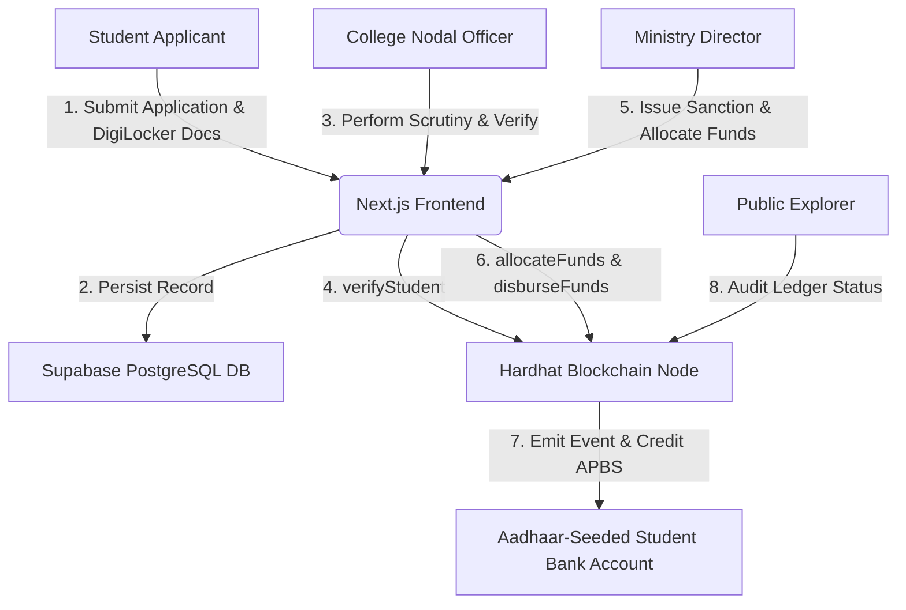

<div align="center">

# 🎓 ScholarParchment
### *National Gateway for Transparent Scholarship Management & Direct Benefit Transfer (DBT)*

[](https://nextjs.org/)
[](https://soliditylang.org/)
[](https://supabase.com)
[](IMPLEMENTATION.md)
[](LICENSE)

*A unified, transparent, and tamper-evident national scholarship management and direct benefit transfer platform connecting Students, Educational Institutions, and Central Ministries.*

---

</div>

> 📘 **Looking for full system implementation specs?** Read the detailed **[IMPLEMENTATION.md](IMPLEMENTATION.md)** architecture document.

---

## 📌 Executive Summary

**ScholarParchment** solves critical inefficiencies, document fraud, and delayed scholarship fund disbursements across Indian higher education institutions. Built for Smart India Hackathon (SIH 2026), the platform combines **Supabase PostgreSQL database storage** for off-chain document records with an **Ethereum smart contract ledger (`ScholarshipTracker.sol`)** to guarantee zero-leakage, instant Direct Benefit Transfer (DBT) into Aadhaar-seeded student bank accounts.

---

## ✨ Key Features

- 🔐 **Unified Single Sign-On (SSO)**: Role-specific portals for Students, College Nodal Verification Officers, and Central Ministry Directors.
- 🗄️ **Mandatory Supabase Database Storage**: Real-time PostgreSQL database persistence for application documents, scrutiny notes, and audit logs.
- 📜 **Cryptographic Blockchain Ledger**: Hardhat / Ethers.js v6 smart contract tracking student verifications, fund allocations, and DBT disbursements.
- 💳 **PFMS & NPCI APBS Integration**: Simulated Direct Benefit Transfer. 
- 🔎 **Public "Glass-Pipe" Explorer**: Open verification portal allowing public audit of fund movements by Student ID without compromising personal PII data.
- 📑 **Certified Vault**: Automated verification of academic marksheets and income certificates.

---

## 🏛️ System Architecture



---

## 👥 Pre-Seeded System Logins

The application includes **7 pre-seeded authorized accounts** ready for testing across all personas:

| Persona | Name | Email / ID | Institution / Department | Role |
| :--- | :--- | :--- | :--- | :--- |
| **Student 1** | Aarav Sharma | `aarav.sharma@iitd.ac.in` | IIT Delhi (Computer Science) | `student` |
| **Student 2** | Priya Patel | `priya.patel@vjti.ac.in` | VJTI Mumbai (Electronics) | `student` |
| **Student 3** | Rahul Verma | `rahul.verma@nitt.edu` | NIT Trichy (Mechanical) | `student` |
| **Student 4** | Ananya Sen | `ananya.sen@ju.ac.in` | Jadavpur University (Computer Science) | `student` |
| **Student 5** | Vikram Singh | `vikram.singh@bits.edu` | BITS Pilani (Electrical) | `student` |
| **College Nodal** | Dr. Rajeshwari Menon | `verifications@iitd.ac.in` | IIT Delhi (AISHE: U-0100) | `college` |
| **Ministry Director** | Shri Vikramaditya Roy, IAS | `director.scholarships@education.gov.in` | Ministry of Education, Govt. of India | `ministry` |

> 🔑 **Password for all pre-seeded accounts**: `Password@123`

---

## 🚀 Quick Start Guide

### Prerequisites
- [Node.js](https://nodejs.org/) v18.0 or higher
- [npm](https://www.npmjs.com/) v9.0 or higher
- Active [Supabase](https://supabase.com) project

---

### 1. Clone & Install Dependencies

```bash
git clone https://github.com/sujay-237/ScholarParchment.git
cd ScholarParchment
npm install
```

---

### 2. Configure Environment Variables

Create a `.env.local` file at the root of the project:

```env
# Blockchain RPC & Smart Contract Address
NEXT_PUBLIC_RPC_URL=http://127.0.0.1:8545
CONTRACT_ADDRESS=0x0000000000000000000000000000000000000000

# Hardhat Role Private Keys
MINISTRY_PRIVATE_KEY=0xYOUR_MINISTRY_ADMIN_PRIVATE_KEY_HERE
COLLEGE_PRIVATE_KEY=0xYOUR_COLLEGE_VERIFIER_PRIVATE_KEY_HERE

# Supabase Credentials (Required)
NEXT_PUBLIC_SUPABASE_URL=https://your-project.supabase.co
NEXT_PUBLIC_SUPABASE_PUBLISHABLE_KEY=your-publishable-key
SUPABASE_SECRET_KEY=your-service-role-key
```

---

### 3. Initialize Supabase Database Tables & Seed Data

Run the database setup script in your **Supabase Dashboard SQL Editor**:
1. Copy the contents of [`supabase/schema_and_seed.sql`](supabase/schema_and_seed.sql).
2. Open your [Supabase SQL Editor](https://supabase.com/dashboard).
3. Paste and click **Run**.

Alternatively, execute the Node seed command:
```bash
npm run seed:supabase
```

---

### 4. Launch the Local Blockchain Node

In a separate terminal:

```bash
npm run chain
```
> Exposes JSON-RPC node on `http://127.0.0.1:8545`.

---

### 5. Deploy Smart Contract

In another terminal:

```bash
npm run deploy
```
> Deploys `ScholarshipTracker.sol` and outputs the contract address.

---

### 6. Start Next.js Web Portal

```bash
npm run dev
```

Open [http://localhost:3000](http://localhost:3000) in your browser. Sign in via [http://localhost:3000/auth](http://localhost:3000/auth).

---

## 🛠️ API Reference

| Method | Endpoint | Description |
| :--- | :--- | :--- |
| `POST` | `/api/verify` | College Nodal Officer verifies student eligibility on-chain. |
| `POST` | `/api/allocate` | Ministry allocates sanctioned ETH funds for a student on-chain. |
| `POST` | `/api/disburse` | Ministry disburses funds directly to student address via smart contract. |
| `GET` | `/api/explorer/[studentId]` | Public Explorer aggregated view combining Supabase profile & blockchain status. |
| `GET` | `/api/test-supabase` | Supabase database connection health check. |

---

## 🧰 Tech Stack

- **Frontend**: Next.js 14 (App Router), React 18, Tailwind CSS 3, Lucide Icons, Canvas Confetti
- **Backend**: Next.js API Routes, Supabase (PostgreSQL), `@supabase/supabase-js`
- **Blockchain**: Solidity 0.8.20, Hardhat 3, Ethers.js v6, OpenZeppelin Contracts
- **Security**: SHA-256 Ledger Hashing, Digital Signature Certificates (DSC), Role-Based Access Control

---

## 📄 Documentation Files

- 📘 **[IMPLEMENTATION.md](IMPLEMENTATION.md)** — Detailed technical implementation architecture, schema designs, and smart contract specs.
- ⚙️ **[ENV_SETUP.md](ENV_SETUP.md)** — Environment configuration guide.
- 📜 **[LICENSE](LICENSE)** — Official MIT License terms.

---

<div align="center">

Made for **Smart India Hackathon (SIH 2026)** • Ministry of Education & NIC

</div>
